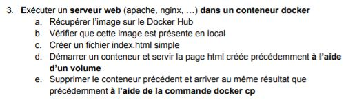
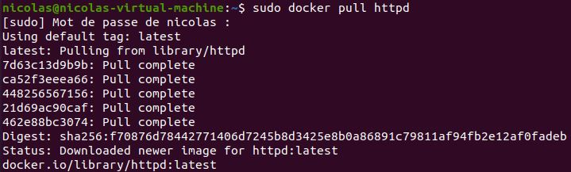
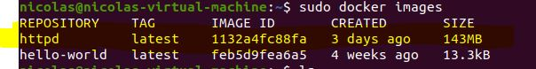
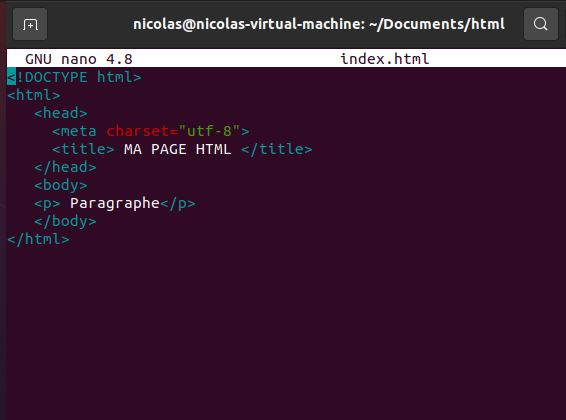
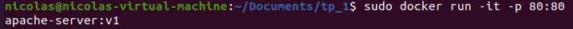
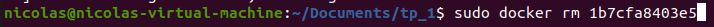
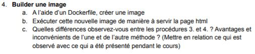
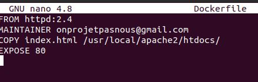
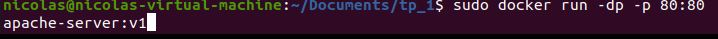

**TP1 DevOps**
**Lafond Nicolas**
 

 
a. 
 
b. 
 
c. 
 
d. 
 
e. 
 

 
a. 
 
b. 
 
c. La méthode 4 est plus facilement transportable et fait tout les réglages d'un coup, il n'y a qu'a lancer le dockerfile
 
